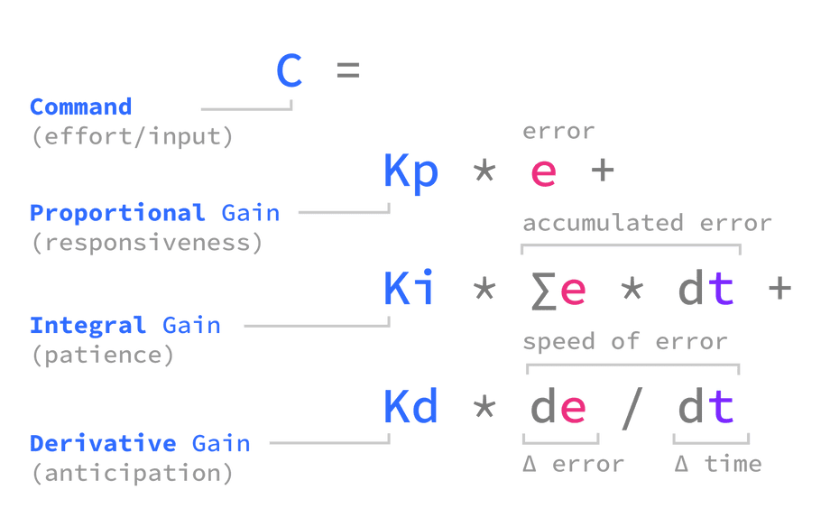
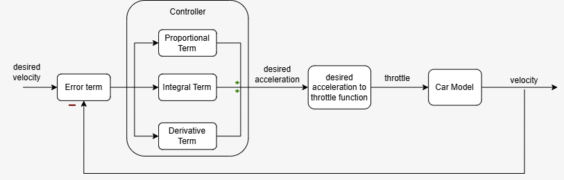

# Project 1: PID controller

The PID controller(above) uses 3 terms with 3 tuned constants, to compute a command that minimizes error. 

### Intro 

As the autonomous team we aim to build a working driverless system for the 2027 Driverless event this June at competition. In order to complete this we need to build a working software stack, manage hardware integration with other teams, and most importantly follow all FSAE rules.
Here is a high level overview of our current software stack:
1. **Perception** which includes monocular depth estimation and object detection using YOLACT edge.
   - Using our camera we are able to detect cone locations, find the distance of cones, and classify each cone as a specific type.
2. **Simultaneous Localization And Mapping(SLAM)** which builds a local map and global map of all cones
   - Using our **Perception** data we can build a map around us, and we can form a larger global map as we continue through the track.
3. **Path Planning** which builds a set of waypoints for our car to follow.
   - Using our **SLAM** cone map data we can use cost functions and midpoint algorithms to find a path through the cones. 
4. **Control Planning** which outputs the final vehicle commands to the motor and actuators using a PID longitudinal controller and Pure Pursuit Lateral controller.
   - Using our waypoints from **Path Planning** we can compute our car's needed acceleration and yaw to follow the path at our desired speed.

In this project we'll have you implement a basic PID controller, which is used commonly as an easy approach to control planning in a software stack. PID controllers are longitudinal meaning they focus on maintaining a speed, not focusing on the lateral control which is the steering. PID controllers are popular outside this use, they can be used in any scenario to approach and follow a desired value you want, in our case a desired velocity. 

If this were a project as part of the team rather than onboarding, it may be followed up with creating a lateral controller, building tests, debugging, adding code safety features, and integrating with the full stack. 

There are two templates in this folder that will help you start, the instructions will refer to parts of those specific templates although you're free to do your own thing. We have linked resources to help, but if you ever need more I definitely suggest just googling, the topics in this project are very well covered online and there are tons of helpful resources. 

### Brief on PID Controllers:

Before building I recommend watching this [matlab video](https://www.mathworks.com/discovery/pid-control.html) on PID controllers once through, if you don't understand it immediately don't worry. Completing this project will help you have a solid grasp on PID controllers, which are a fundamental yet simple control method used in many machines. 

### If you haven’t taken Calculus:

Understanding what a derivative and integral are conceptually is important to fully understanding how PID controllers work. Here is a crash course by the [Organic Chemistry Tutor](https://www.youtube.com/watch?v=WsQQvHm4lSw&t=434s), I recommend to skip to 17:00 and watch his description of the two.

The needed understanding for this project is: Integral is the TOTAL error throughout a run measured by the area accumulated under a curve measuring error at each time step. And the derivative is HOW FAST the error is increasing or decreasing measured by the slope.

### Project Instructions

**PROJECT GOAL**: Given a simplified 1-dimensional car, whose state variables are stored in a dictionary. Build a PID controller which makes the car’s velocity converge toward a desired velocity. Use provided equation above for reference throughout this project. 

Here is a flow chart of the complete system. Please use this in combination with the provided equations in the top image. Each term in the flowchart is shown in the equation sheet. 

0. Before you start do the following:
   - Have matplotlib and numpy installed in your environment. 
   - Read all code and docstrings in the templates. If you don't understand the code, reach out to Dylan Price, or message in the auto thread marked for onboarding questions. 
   - **For every function implementation please refer to the equation image for help**.
     - In the equation sheet C(command) is desired acceleration in our project as that is what we are trying to control.

1. Using the desired velocity, `desired_v`, and the current velocity, `car["v"]`, **calculate the difference** between the two, to find **error** of our controller. This error is useful as it will be used to calculate how much acceleration we need to reach the desired velocity, given our current velocity. Your first controller iteration will use a constant, `K_P`, proportional to the error to find this **desired acceleration**. 
    
    Write a function, `calculate_desired_acceleration`, that calculates the **error** and then uses that error to **calculate the desired acceleration**. For this step **only use the proportional term**, do not use the other two terms.
    

2. For the car to reach the desired acceleration you calculated it needs to be converted to a value for the motor. In this simplified model we’ll convert it to a throttle percentage that says what percent of `max_throttle_force` we should use.
    
    Write a function, `acceleration_to_throttle_percentage`, that returns a throttle percentage. 
    1. First find the max possible acceleration given our mass and force, through Newton's second law. 
    2. Then find the throttle percentage using that max possible acceleration and the acceleration we want. 
    3. Finally use `np.clip` from the numpy library to make it a percent between -1 to 1. Google what np.clip does if you haven't used it before. This clipping is done to create a throttle percentage which is in a real range of -100% to 100%.
    

3. Build a run script using matplotlib to make two plots one of your car’s velocity and one of the error over each time step. If you know another way to visualize data than the one described below go ahead, this is just to help.
    -  Create three lists to track your velocities, errors, and times.
    - Create a loop that fills your two lists with their correct data over the number of `STEPS`. Each step should use both functions then `update`, passing in the throttle percentage you calculate. Then using `car["v"]`, `error`, or `car["t"]` you can get values for your lists.
    - Build two plots using [matplotlib.pyplot](https://matplotlib.org/stable/tutorials/pyplot.html) showing your data. 
        - Error over time and Velocity over Time 
    - Both of your graphs should converge to a specific value if done correctly. 

4. Use your run_template.py to tune the `K_P` constant so that your car’s velocity converges closest to the desired velocity. 
    - Start low, below 1 with constants. 
    - Note if you are able to get it to reach the desired velocity. In the first linked PID video, they talk about why this happens. It's called steady state error. 
    - Before moving on either think about it yourself, rewatch the video, or google "Steady state error pid" until you understand what is causing the velocity to not reach the desired velocity. Hint: Look at the car model's code to see how it calculates acceleration at each step. 

5. Refer back to the PID equation to now implement the **integral term** of the controller. You’ll want to use the `car["net_integral"]` so you can sum the error as it accumulates over every single step. This is the summation shown in the **equation sheet provided.** 
    - Every time you calculate error add the error integral, found by error * dt, to the `net_integral`. Then when calculating desired acceleration use the `net_integral` as shown in the equation.  
    - Using run.py once more tune your controller towards the desired velocity. Note how your graph is **different this time.**

6. Now implement the derivative term. You’ll want to use, and write code to update, `car["error_prev"]`. With the previous error and the current error of a step, you can calculate the **change of the error** shown as **de** in the equation sheet. The de is part of the new term, use the equation sheet to implement the whole derivative term. 
    - Once more use run.py and mess around with the values of all three constants. Try and understand what each does.
    - You will likely run into a bug in your **newly added code**. Think about the **first step** of your code, and what each variable in this new code is during that first step. Is there a variable that is impossible to do math with in the first step?

7. Look up a PID tuning table to compare and contrast your observations to the actual functions of constants. 
    - Change the desired velocity, `desired_v`, to multiple different values and use the table to help you tune the controller. 

8. **Extensions** ( Do 2-3, if you do #9 instead you don't need to do any )

    - Implement a stopping point into the PID controller, slows to a stop by a certain distance. 
    - Research gain scheduling for pid’s and implement into your system.
    - Research pid integral windup, find at what constants this happens in your controller and try to fix it.
    - Add in additional forces against the car, increasing/decreasing the friction in intervals throughout the steps. Figure out how to minimize velocity instability during the increased friction. 

9.  **Optional Machine Learning Extension**
    
    **Goal**: Build a basic undertanding of ML concepts, such as tensors, training loops, loss, etc... Build a linear regression model trained on your PID data, to predict the desired acceleration given the current velocity and desired velocity. 

    - If you have a better/different machine learning application using PID data generated from your project I encourage you to try that instead. Especially if it makes more sense to you. 

    - If you haven’t worked with machine learning before, I recommend learning [here](https://www.learnpytorch.io/00_pytorch_fundamentals/). The first two sections 00 and 01 walk you through building a linear regression model. Build their training, plotting, and model first so you can understand everything. Then adapt it or build the pid data one. 
   
    **Advice:**
    
    - If you follow the linked resource to make a linear regression model, the next step to take are:
      - Adjusting your run.py or making a new script to generate tensors of your pid data
      - Change the model to work with your data shape 
      - Change the prediction's plotting to fit your data shape
    - Set `K_I` and `K_D` to zero when generating data, since both depend on variables outside v and v_des.
    - When creating PID data make sure to have the desired velocity change throughout the steps to get data with different values.
    - Adjust your learning rate if your loss isn't dropping, this was a change I made when testing